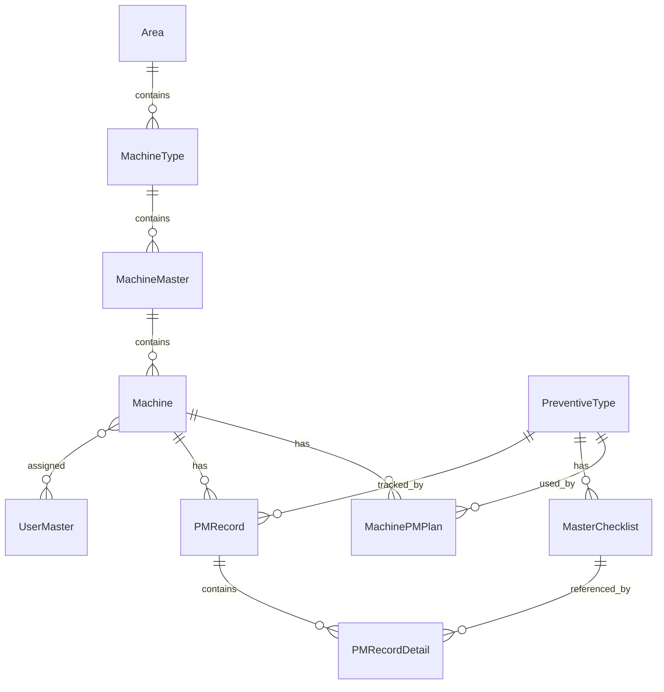

<div align="center">

# 📄 Database Schema Documentation

## ระบบบริหารจัดการการบำรุงรักษาเชิงป้องกัน
## (Preventive Maintenance Management System)

---

**ชื่อโปรเจค:** Maintenance PM Project  
**เวอร์ชัน:** 1.0.0  
**วันที่จัดทำ:** 10 มกราคม 2569 (2026)  
**จัดทำโดย:** ทีมพัฒนาระบบ

---

</div>

---

## 📋 ข้อมูลเอกสาร

| รายการ | รายละเอียด |
|--------|-----------|
| **ชื่อเอกสาร** | Database Schema Documentation |
| **รหัสเอกสาร** | PM-DOC-DB-001 |
| **เวอร์ชัน** | 1.0.0 |
| **วันที่จัดทำ** | 10 มกราคม 2569 |
| **ปรับปรุงล่าสุด** | 10 มกราคม 2569 |
| **สถานะ** | เผยแพร่ (Released) |

---

## 📝 ประวัติการแก้ไข

| เวอร์ชัน | วันที่ | ผู้แก้ไข | รายละเอียดการแก้ไข |
|---------|--------|---------|-------------------|
| 1.0.0 | 10/01/2569 | ทีมพัฒนา | เอกสารฉบับแรก |

---

## สารบัญ

1. [บทนำ](#1-บทนำ)
2. [ภาพรวมระบบฐานข้อมูล](#2-ภาพรวมระบบฐานข้อมูล)
3. [แผนภาพความสัมพันธ์ (ER Diagram)](#3-แผนภาพความสัมพันธ์-er-diagram)
4. [รายละเอียดตาราง](#4-รายละเอียดตาราง)
   - 4.1 [Area](#41-area-พื้นที่)
   - 4.2 [MachineType](#42-machinetype-ประเภทเครื่องจักร)
   - 4.3 [MachineMaster](#43-machinemaster-มาสเตอร์เครื่องจักร)
   - 4.4 [Machine](#44-machine-เครื่องจักร)
   - 4.5 [PreventiveType](#45-preventivetype-ประเภท-pm)
   - 4.6 [MasterChecklist](#46-masterchecklist-รายการตรวจสอบมาตรฐาน)
   - 4.7 [MachinePMPlan](#47-machinepmplan-แผน-pm)
   - 4.8 [PMRecord](#48-pmrecord-บันทึก-pm)
   - 4.9 [PMRecordDetail](#49-pmrecorddetail-รายละเอียด-pm)
   - 4.10 [UserMaster](#410-usermaster-ผู้ใช้งาน)
   - 4.11 [ChecklistTemplate](#411-checklisttemplate-template-checklist)
5. [ความสัมพันธ์ระหว่างตาราง](#5-ความสัมพันธ์ระหว่างตาราง)
6. [ค่าคงที่และข้อมูลอ้างอิง](#6-ค่าคงที่และข้อมูลอ้างอิง)
7. [ภาคผนวก](#7-ภาคผนวก)

---

## 1. บทนำ

### 1.1 วัตถุประสงค์

เอกสารฉบับนี้จัดทำขึ้นเพื่ออธิบายโครงสร้างฐานข้อมูลของระบบบริหารจัดการการบำรุงรักษาเชิงป้องกัน (Preventive Maintenance Management System) โดยละเอียด เพื่อให้ผู้ที่เกี่ยวข้องเข้าใจโครงสร้างข้อมูลและความสัมพันธ์ระหว่างตาราง

### 1.2 ขอบเขต

เอกสารนี้ครอบคลุมตารางทั้งหมด 11 ตาราง ที่ใช้ในระบบ ประกอบด้วย:
- ตารางจัดการโครงสร้างองค์กร (Area, MachineType, MachineMaster)
- ตารางจัดการเครื่องจักร (Machine)
- ตารางจัดการแผน PM (PreventiveType, MasterChecklist, MachinePMPlan)
- ตารางบันทึกผล PM (PMRecord, PMRecordDetail)
- ตารางจัดการผู้ใช้งาน (UserMaster)

### 1.3 กลุ่มผู้ใช้งานเอกสาร

- นักพัฒนาระบบ (Developers)
- ผู้ดูแลฐานข้อมูล (Database Administrators)
- ผู้วิเคราะห์ระบบ (System Analysts)

---

## 2. ภาพรวมระบบฐานข้อมูล

### 2.1 ข้อมูลทั่วไป

| รายการ | รายละเอียด |
|--------|-----------|
| **ระบบจัดการฐานข้อมูล** | Microsoft SQL Server |
| **ORM** | Prisma |
| **จำนวนตาราง** | 11 ตาราง |
| **Character Set** | UTF-8 |

### 2.2 สรุปตารางทั้งหมด

| ลำดับ | ชื่อตาราง | คำอธิบาย | จำนวนฟิลด์ |
|-------|-----------|---------|-----------|
| 1 | Area | พื้นที่/โซนในโรงงาน | 3 |
| 2 | MachineType | ประเภทเครื่องจักร | 4 |
| 3 | MachineMaster | มาสเตอร์เครื่องจักร (Template) | 5 |
| 4 | Machine | เครื่องจักร | 9 |
| 5 | PreventiveType | ประเภทการบำรุงรักษา PM | 8 |
| 6 | MasterChecklist | รายการตรวจสอบมาตรฐาน | 14 |
| 7 | MachinePMPlan | แผน PM ของเครื่องจักร | 8 |
| 8 | ChecklistTemplate | Template Checklist เฉพาะเครื่อง | 9 |
| 9 | PMRecord | บันทึกการทำ PM | 8 |
| 10 | PMRecordDetail | รายละเอียดการตรวจสอบ PM | 12 |
| 11 | UserMaster | ผู้ใช้งานระบบ | 10 |

---

## 3. แผนภาพความสัมพันธ์ (ER Diagram)

### 3.1 Hierarchy หลักของระบบ

```
┌─────────────────────────────────────────────────────────────────┐
│                        โครงสร้างองค์กร                           │
├─────────────────────────────────────────────────────────────────┤
│                                                                 │
│   ┌──────────┐    1:N    ┌─────────────┐    1:N    ┌─────────┐ │
│   │   Area   │ ───────▶  │ MachineType │ ───────▶  │ Machine │ │
│   │ (พื้นที่) │           │ (ประเภท)    │           │ Master  │ │
│   └──────────┘           └─────────────┘           └────┬────┘ │
│                                                         │ 1:N  │
│                                                         ▼      │
│                                                   ┌──────────┐ │
│                                                   │ Machine  │ │
│                                                   │(เครื่อง) │ │
│                                                   └──────────┘ │
└─────────────────────────────────────────────────────────────────┘
```

### 3.2 ระบบ PM

```
┌─────────────────────────────────────────────────────────────────┐
│                         ระบบ PM                                 │
├─────────────────────────────────────────────────────────────────┤
│                                                                 │
│   ┌────────────────┐    1:N    ┌─────────────────┐             │
│   │ PreventiveType │ ───────▶  │ MasterChecklist │             │
│   │   (ประเภท PM)  │           │  (รายการตรวจ)   │             │
│   └───────┬────────┘           └─────────────────┘             │
│           │ 1:N                                                 │
│           ▼                                                     │
│   ┌────────────────┐                                           │
│   │ MachinePMPlan  │◀──────── Machine                          │
│   │  (แผน PM)      │   N:1                                     │
│   └───────┬────────┘                                           │
│           │                                                     │
│           ▼ เมื่อทำ PM                                          │
│   ┌────────────────┐    1:N    ┌─────────────────┐             │
│   │   PMRecord     │ ───────▶  │ PMRecordDetail  │             │
│   │  (บันทึก PM)   │           │ (รายละเอียด)    │             │
│   └────────────────┘           └─────────────────┘             │
│                                                                 │
└─────────────────────────────────────────────────────────────────┘
```

### 3.3 ER Diagram แบบ Mermaid



---

## 4. รายละเอียดตาราง

### 4.1 Area (พื้นที่)

**คำอธิบาย:** ตารางสำหรับจัดเก็บข้อมูลพื้นที่/โซนในโรงงาน

| ฟิลด์ | ประเภท | Null | Key | Default | คำอธิบาย |
|-------|--------|------|-----|---------|---------|
| id | Int | ❌ | PK | Auto | รหัสพื้นที่ |
| name | String | ❌ | UK | - | ชื่อพื้นที่ เช่น "CLASS100", "OUTDOOR" |
| description | String | ✅ | - | - | คำอธิบายพื้นที่ |

**ความสัมพันธ์:**
- มีหลาย `MachineType` (One-to-Many)

**ตัวอย่างข้อมูล:**
| id | name | description |
|----|------|-------------|
| 1 | CLASS100 | พื้นที่ Class 100 - Clean Room |
| 2 | OUTDOOR | พื้นที่กลางแจ้ง |

---

### 4.2 MachineType (ประเภทเครื่องจักร)

**คำอธิบาย:** ตารางสำหรับจัดเก็บประเภทเครื่องจักร

| ฟิลด์ | ประเภท | Null | Key | Default | คำอธิบาย |
|-------|--------|------|-----|---------|---------|
| id | Int | ❌ | PK | Auto | รหัสประเภท |
| name | String | ❌ | UK | - | ชื่อประเภท เช่น "LSM", "VNS" |
| description | String | ✅ | - | - | คำอธิบาย |
| areaId | Int | ✅ | FK | - | รหัสพื้นที่ → Area.id |

**ความสัมพันธ์:**
- อยู่ใน `Area` (Many-to-One)
- มีหลาย `MachineMaster` (One-to-Many)

**Index:** areaId

---

### 4.3 MachineMaster (มาสเตอร์เครื่องจักร)

**คำอธิบาย:** ตารางสำหรับจัดเก็บ Template เครื่องจักร

| ฟิลด์ | ประเภท | Null | Key | Default | คำอธิบาย |
|-------|--------|------|-----|---------|---------|
| id | Int | ❌ | PK | Auto | รหัส |
| code | String | ❌ | UK | - | รหัสมาสเตอร์ เช่น "MC-001" |
| name | String | ❌ | - | - | ชื่อมาสเตอร์ |
| description | String | ✅ | - | - | คำอธิบาย |
| machineTypeId | Int | ✅ | FK | - | รหัสประเภท → MachineType.id |

**ความสัมพันธ์:**
- อยู่ใน `MachineType` (Many-to-One)
- มีหลาย `Machine` (One-to-Many)

**Index:** machineTypeId

---

### 4.4 Machine (เครื่องจักร)

**คำอธิบาย:** ตารางหลักสำหรับจัดเก็บข้อมูลเครื่องจักร

| ฟิลด์ | ประเภท | Null | Key | Default | คำอธิบาย |
|-------|--------|------|-----|---------|---------|
| id | Int | ❌ | PK | Auto | รหัสเครื่อง |
| code | String | ❌ | UK | - | รหัสเครื่อง เช่น "LSM-001" |
| name | String | ❌ | - | - | ชื่อเครื่อง |
| model | String | ✅ | - | - | รุ่นเครื่อง |
| location | String | ✅ | - | - | ตำแหน่งที่ตั้ง |
| image | String | ✅ | - | - | Path รูปภาพเครื่อง |
| machineMasterId | Int | ✅ | FK | - | รหัสมาสเตอร์ → MachineMaster.id |
| createdAt | DateTime | ❌ | - | now() | วันที่สร้าง |
| updatedAt | DateTime | ❌ | - | Auto | วันที่แก้ไขล่าสุด |

**ความสัมพันธ์:**
- อยู่ใน `MachineMaster` (Many-to-One)
- มีหลาย `MachinePMPlan` (One-to-Many)
- มีหลาย `PMRecord` (One-to-Many)
- มอบหมายให้หลาย `UserMaster` (Many-to-Many)

---

### 4.5 PreventiveType (ประเภท PM)

**คำอธิบาย:** ตารางสำหรับจัดเก็บประเภทการบำรุงรักษาเชิงป้องกัน

| ฟิลด์ | ประเภท | Null | Key | Default | คำอธิบาย |
|-------|--------|------|-----|---------|---------|
| id | Int | ❌ | PK | Auto | รหัส |
| name | String | ❌ | UK | - | ชื่อประเภท PM เช่น "Weekly PM" |
| description | String | ✅ | - | - | คำอธิบาย |
| image | String | ✅ | - | - | รูป Diagram |
| isFixedDate | Boolean | ❌ | - | true | วันที่คงที่ (true) หรือยืดหยุ่น (false) |
| postponeLogic | String | ❌ | - | "SHIFT" | วิธีเลื่อน: "SHIFT" หรือ "MAINTAIN_CYCLE" |
| emailRecipients | String | ✅ | - | - | อีเมลผู้รับแจ้งเตือน (คั่นด้วย comma) |
| notifyAdvanceDays | Int | ❌ | - | 3 | แจ้งเตือนล่วงหน้ากี่วัน |

**ความสัมพันธ์:**
- มีหลาย `MachinePMPlan` (One-to-Many)
- มีหลาย `MasterChecklist` (One-to-Many)
- มีหลาย `PMRecord` (One-to-Many)

---

### 4.6 MasterChecklist (รายการตรวจสอบมาตรฐาน)

**คำอธิบาย:** ตารางสำหรับจัดเก็บรายการตรวจสอบมาตรฐานของแต่ละประเภท PM

| ฟิลด์ | ประเภท | Null | Key | Default | คำอธิบาย |
|-------|--------|------|-----|---------|---------|
| id | Int | ❌ | PK | Auto | รหัส |
| preventiveTypeId | Int | ❌ | FK | - | รหัสประเภท PM → PreventiveType.id |
| topic | String | ❌ | - | - | หัวข้อตรวจสอบ |
| description | String | ✅ | - | - | คำอธิบาย |
| type | String | ❌ | - | - | ประเภท: "BOOLEAN" หรือ "NUMERIC" |
| minVal | Float | ✅ | - | - | ค่าต่ำสุด (สำหรับ NUMERIC) |
| maxVal | Float | ✅ | - | - | ค่าสูงสุด (สำหรับ NUMERIC) |
| options | String | ✅ | - | - | ตัวเลือก Dropdown (JSON) |
| isRequired | Boolean | ❌ | - | false | จำเป็นต้องกรอก |
| useValueLimit | Boolean | ❌ | - | false | จำกัดการใช้ค่าซ้ำ |
| valueLimitCount | Int | ❌ | - | 0 | จำนวนครั้งที่ใช้ค่าซ้ำได้ |
| valueLimitHours | Int | ❌ | - | 0 | ช่วงเวลาจำกัด (ชั่วโมง) |
| isActive | Boolean | ❌ | - | true | สถานะใช้งาน |
| order | Int | ❌ | - | 0 | ลำดับการแสดง |

**ความสัมพันธ์:**
- อยู่ใน `PreventiveType` (Many-to-One)
- มีหลาย `PMRecordDetail` (One-to-Many)

---

### 4.7 MachinePMPlan (แผน PM)

**คำอธิบาย:** ตารางสำหรับจัดเก็บแผนการบำรุงรักษาของแต่ละเครื่อง

| ฟิลด์ | ประเภท | Null | Key | Default | คำอธิบาย |
|-------|--------|------|-----|---------|---------|
| id | Int | ❌ | PK | Auto | รหัส |
| machineId | Int | ❌ | FK | - | รหัสเครื่อง → Machine.id |
| preventiveTypeId | Int | ❌ | FK | - | รหัสประเภท PM → PreventiveType.id |
| frequencyDays | Int | ❌ | - | - | ความถี่การทำ PM (วัน) |
| advanceNotifyDays | Int | ❌ | - | - | แจ้งเตือนล่วงหน้า (วัน) |
| lastPMDate | DateTime | ✅ | - | - | วันที่ทำ PM ล่าสุด |
| nextPMDate | DateTime | ✅ | - | - | วันที่ทำ PM ถัดไป |
| lastCheckStatus | String | ✅ | - | - | ผล PM ล่าสุด: "ALL_OK" / "HAS_NG" |

**Unique Constraint:** (machineId, preventiveTypeId)

**ความสัมพันธ์:**
- อยู่ใน `Machine` (Many-to-One) - Cascade Delete
- อยู่ใน `PreventiveType` (Many-to-One)

**Index:** machineId, preventiveTypeId

---

### 4.8 PMRecord (บันทึก PM)

**คำอธิบาย:** ตารางสำหรับจัดเก็บบันทึกการทำ PM

| ฟิลด์ | ประเภท | Null | Key | Default | คำอธิบาย |
|-------|--------|------|-----|---------|---------|
| id | Int | ❌ | PK | Auto | รหัส |
| machineId | Int | ❌ | FK | - | รหัสเครื่อง → Machine.id |
| preventiveTypeId | Int | ✅ | FK | - | รหัสประเภท PM → PreventiveType.id |
| date | DateTime | ❌ | - | now() | วันที่บันทึก |
| inspector | String | ✅ | - | - | ผู้ตรวจสอบ (Cleaning By) |
| checker | String | ✅ | - | - | ผู้ตรวจรับ (Check By) |
| status | String | ❌ | - | - | สถานะ: "PLANNED" / "COMPLETED" / "LATE" |
| remark | String | ✅ | - | - | หมายเหตุ |

**ความสัมพันธ์:**
- อยู่ใน `Machine` (Many-to-One)
- อยู่ใน `PreventiveType` (Many-to-One)
- มีหลาย `PMRecordDetail` (One-to-Many)

**Index:** date, machineId, preventiveTypeId, inspector, status

---

### 4.9 PMRecordDetail (รายละเอียด PM)

**คำอธิบาย:** ตารางสำหรับจัดเก็บรายละเอียดการตรวจสอบแต่ละหัวข้อ

| ฟิลด์ | ประเภท | Null | Key | Default | คำอธิบาย |
|-------|--------|------|-----|---------|---------|
| id | Int | ❌ | PK | Auto | รหัส |
| recordId | Int | ❌ | FK | - | รหัสบันทึก → PMRecord.id |
| checklistId | Int | ✅ | FK | - | รหัส Checklist → MasterChecklist.id |
| topic | String | ✅ | - | - | Snapshot หัวข้อตรวจสอบ |
| isPass | Boolean | ❌ | - | false | ผลการตรวจ: ผ่าน/ไม่ผ่าน |
| value | String | ✅ | - | - | ค่าที่ตรวจวัด (สำหรับ NUMERIC) |
| remark | String | ✅ | - | - | หมายเหตุ |
| subItemName | String | ✅ | - | - | ชื่อ Sub-item เช่น "Fixture 1" |
| image | NVarChar(Max) | ✅ | - | - | รูปภาพที่ถ่าย |
| imageBefore | NVarChar(Max) | ✅ | - | - | รูปก่อนทำ |
| imageAfter | NVarChar(Max) | ✅ | - | - | รูปหลังทำ |

**ความสัมพันธ์:**
- อยู่ใน `PMRecord` (Many-to-One) - Cascade Delete
- อ้างอิง `MasterChecklist` (Many-to-One)

**Index:** recordId, checklistId, value

---

### 4.10 UserMaster (ผู้ใช้งาน)

**คำอธิบาย:** ตารางสำหรับจัดเก็บข้อมูลผู้ใช้งาน

| ฟิลด์ | ประเภท | Null | Key | Default | คำอธิบาย |
|-------|--------|------|-----|---------|---------|
| id | Int | ❌ | PK | Auto | รหัส |
| employeeId | String | ✅ | - | - | รหัสพนักงาน |
| name | String | ❌ | - | - | ชื่อ-นามสกุล |
| email | String | ✅ | - | - | อีเมล |
| role | String | ❌ | - | - | บทบาท: "INSPECTOR" / "CHECKER" / "BOTH" |
| username | String | ✅ | - | - | ชื่อผู้ใช้ (Login) |
| password | String | ✅ | - | - | รหัสผ่าน |
| systemRole | String | ❌ | - | "USER" | สิทธิ์ระบบ: "ADMIN" / "USER" |
| permissionType | String | ❌ | - | "PM_ONLY" | สิทธิ์ PM (ดูหัวข้อ 6.4) |

**ความสัมพันธ์:**
- มอบหมายให้เครื่องจักรหลายเครื่อง `Machine` (Many-to-Many)

---

### 4.11 ChecklistTemplate (Template Checklist)

**คำอธิบาย:** ตารางสำหรับจัดเก็บ Checklist เฉพาะของแต่ละเครื่อง

| ฟิลด์ | ประเภท | Null | Key | Default | คำอธิบาย |
|-------|--------|------|-----|---------|---------|
| id | Int | ❌ | PK | Auto | รหัส |
| machineId | Int | ❌ | FK | - | รหัสเครื่อง → Machine.id |
| topic | String | ❌ | - | - | หัวข้อตรวจสอบ |
| description | String | ✅ | - | - | คำอธิบาย |
| type | String | ❌ | - | "BOOLEAN" | ประเภท: "BOOLEAN" / "NUMERIC" |
| minVal | Float | ✅ | - | - | ค่าต่ำสุด |
| maxVal | Float | ✅ | - | - | ค่าสูงสุด |
| order | Int | ❌ | - | 0 | ลำดับการแสดง |
| image | String | ✅ | - | - | รูปอ้างอิง |

**ความสัมพันธ์:**
- อยู่ใน `Machine` (Many-to-One) - Cascade Delete

**Index:** machineId

---

## 5. ความสัมพันธ์ระหว่างตาราง

### 5.1 สรุปความสัมพันธ์หลัก

| ตารางต้นทาง | ความสัมพันธ์ | ตารางปลายทาง | FK Field |
|-------------|-------------|--------------|----------|
| Area | 1:N | MachineType | areaId |
| MachineType | 1:N | MachineMaster | machineTypeId |
| MachineMaster | 1:N | Machine | machineMasterId |
| Machine | 1:N | MachinePMPlan | machineId |
| Machine | 1:N | PMRecord | machineId |
| Machine | N:N | UserMaster | (Implicit) |
| PreventiveType | 1:N | MachinePMPlan | preventiveTypeId |
| PreventiveType | 1:N | MasterChecklist | preventiveTypeId |
| PreventiveType | 1:N | PMRecord | preventiveTypeId |
| PMRecord | 1:N | PMRecordDetail | recordId |
| MasterChecklist | 1:N | PMRecordDetail | checklistId |
| Machine | 1:N | ChecklistTemplate | machineId |

### 5.2 Cascade Rules

| ตาราง | Cascade Delete |
|-------|----------------|
| Machine → MachinePMPlan | ✅ ใช่ |
| Machine → ChecklistTemplate | ✅ ใช่ |
| PMRecord → PMRecordDetail | ✅ ใช่ |
| อื่นๆ | ❌ ไม่ใช่ |

---

## 6. ค่าคงที่และข้อมูลอ้างอิง

### 6.1 System Role

| ค่า | คำอธิบาย |
|-----|---------|
| ADMIN | ผู้ดูแลระบบ - เข้าถึงได้ทุกฟังก์ชัน |
| USER | ผู้ใช้งานทั่วไป - เข้าถึงตามสิทธิ์ที่กำหนด |

### 6.2 User Role

| ค่า | คำอธิบาย |
|-----|---------|
| INSPECTOR | ผู้ตรวจสอบ (Cleaning By) |
| CHECKER | ผู้ตรวจรับ (Check By) |
| BOTH | ทั้งสองบทบาท |

### 6.3 PM Status

| ค่า | คำอธิบาย |
|-----|---------|
| PLANNED | วางแผนแล้ว รอดำเนินการ |
| COMPLETED | ดำเนินการเสร็จสิ้น |
| LATE | เลยกำหนดการ |

### 6.4 Permission Type

| ค่า | คำอธิบาย |
|-----|---------|
| PM_ONLY | ทำ PM ได้อย่างเดียว |
| RESCHEDULE_ONLY | เลื่อนกำหนด PM ได้อย่างเดียว |
| PM_AND_RESCHEDULE | ทำ PM และเลื่อนกำหนดได้ |

### 6.5 Checklist Type

| ค่า | คำอธิบาย |
|-----|---------|
| BOOLEAN | ตรวจสอบแบบ OK/NG |
| NUMERIC | ตรวจสอบแบบตัวเลข (มีค่า min/max) |

### 6.6 Last Check Status

| ค่า | คำอธิบาย |
|-----|---------|
| ALL_OK | ผลการตรวจสอบผ่านทั้งหมด |
| HAS_NG | มีรายการไม่ผ่าน |

### 6.7 Postpone Logic

| ค่า | คำอธิบาย |
|-----|---------|
| SHIFT | เลื่อนวันถัดไปทั้งหมด |
| MAINTAIN_CYCLE | คงรอบเดิม |

---

## 7. ภาคผนวก

### 7.1 Database Connection String

```
sqlserver://{hostname}:{port};database={database_name};user={username};password={password};encrypt=true;trustServerCertificate=true
```

### 7.2 Prisma Configuration

การเชื่อมต่อฐานข้อมูลผ่าน Prisma ORM:

```prisma
datasource db {
  provider = "sqlserver"
  url      = env("DATABASE_URL")
}
```

### 7.3 หมายเหตุสำคัญ

> **⚠️ ข้อควรระวัง:**
> - Password ถูกเก็บเป็น Plain Text ตามการออกแบบระบบ
> - ฟิลด์ที่มี `Unique` จะต้องไม่ซ้ำกันในตาราง
> - Cascade Delete ควรใช้ด้วยความระมัดระวัง

---

<div align="center">

---

**© 2026 Maintenance PM Project**

เอกสารนี้เป็นความลับ ห้ามเผยแพร่โดยไม่ได้รับอนุญาต

---

</div>
