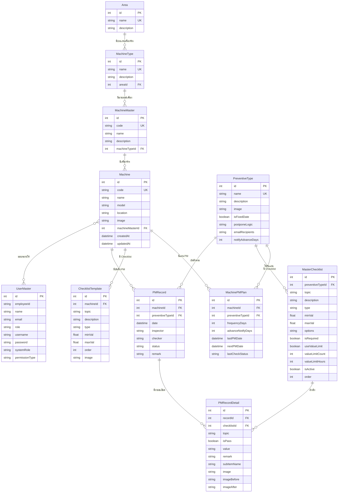

# เอกสาร Database Schema Documentation

## ระบบ Maintenance PM Project

เอกสารนี้อธิบายโครงสร้างฐานข้อมูลทั้งหมดสำหรับระบบ Preventive Maintenance

---

## 📋 สารบัญ

1. [ภาพรวมระบบฐานข้อมูล](#ภาพรวมระบบฐานข้อมูล)
2. [ER Diagram](#er-diagram)
3. [รายละเอียดตาราง](#รายละเอียดตาราง)
4. [ความสัมพันธ์ระหว่างตาราง](#ความสัมพันธ์ระหว่างตาราง)

---

## ภาพรวมระบบฐานข้อมูล

### ข้อมูลทั่วไป
| รายการ | รายละเอียด |
|--------|-----------|
| **Database** | SQL Server |
| **ORM** | Prisma |
| **จำนวนตาราง** | 11 ตาราง |

### รายชื่อตารางทั้งหมด
| ลำดับ | ชื่อตาราง | คำอธิบาย |
|-------|-----------|---------|
| 1 | Area | พื้นที่/โซนในโรงงาน |
| 2 | MachineType | ประเภทเครื่องจักร |
| 3 | MachineMaster | มาสเตอร์เครื่องจักร (Template) |
| 4 | Machine | เครื่องจักร |
| 5 | PreventiveType | ประเภทการบำรุงรักษา PM |
| 6 | MasterChecklist | รายการตรวจสอบมาตรฐาน |
| 7 | MachinePMPlan | แผน PM ของเครื่องจักร |
| 8 | ChecklistTemplate | Template Checklist เฉพาะเครื่อง |
| 9 | PMRecord | บันทึกการทำ PM |
| 10 | PMRecordDetail | รายละเอียดการตรวจสอบ PM |
| 11 | UserMaster | ผู้ใช้งานระบบ |

---

## ER Diagram



---

## รายละเอียดตาราง

### 1. Area (พื้นที่)

ตารางสำหรับจัดเก็บข้อมูลพื้นที่/โซนในโรงงาน

| ฟิลด์ | ประเภท | Null | คำอธิบาย |
|-------|--------|------|---------|
| id | Int | ❌ | Primary Key (Auto Increment) |
| name | String | ❌ | ชื่อพื้นที่ (Unique) เช่น "CLASS100", "OUTDOOR" |
| description | String | ✅ | คำอธิบายพื้นที่ |

**ความสัมพันธ์:**
- มีหลาย `MachineType` (One-to-Many)

---

### 2. MachineType (ประเภทเครื่องจักร)

ตารางสำหรับจัดเก็บประเภทเครื่องจักร

| ฟิลด์ | ประเภท | Null | คำอธิบาย |
|-------|--------|------|---------|
| id | Int | ❌ | Primary Key |
| name | String | ❌ | ชื่อประเภท (Unique) เช่น "LSM", "VNS" |
| description | String | ✅ | คำอธิบาย |
| areaId | Int | ✅ | FK → Area.id |

**ความสัมพันธ์:**
- อยู่ใน `Area` (Many-to-One)
- มีหลาย `MachineMaster` (One-to-Many)

---

### 3. MachineMaster (มาสเตอร์เครื่องจักร)

ตารางสำหรับจัดเก็บ Template เครื่องจักร

| ฟิลด์ | ประเภท | Null | คำอธิบาย |
|-------|--------|------|---------|
| id | Int | ❌ | Primary Key |
| code | String | ❌ | รหัสมาสเตอร์ (Unique) เช่น "MC-001" |
| name | String | ❌ | ชื่อมาสเตอร์ |
| description | String | ✅ | คำอธิบาย |
| machineTypeId | Int | ✅ | FK → MachineType.id |

**ความสัมพันธ์:**
- อยู่ใน `MachineType` (Many-to-One)
- มีหลาย `Machine` (One-to-Many)

---

### 4. Machine (เครื่องจักร)

ตารางหลักสำหรับจัดเก็บข้อมูลเครื่องจักร

| ฟิลด์ | ประเภท | Null | คำอธิบาย |
|-------|--------|------|---------|
| id | Int | ❌ | Primary Key |
| code | String | ❌ | รหัสเครื่อง (Unique) เช่น "LSM-001" |
| name | String | ❌ | ชื่อเครื่อง |
| model | String | ✅ | รุ่นเครื่อง |
| location | String | ✅ | ตำแหน่งที่ตั้ง |
| image | String | ✅ | Path รูปภาพเครื่อง |
| machineMasterId | Int | ✅ | FK → MachineMaster.id |
| createdAt | DateTime | ❌ | วันที่สร้าง |
| updatedAt | DateTime | ❌ | วันที่แก้ไขล่าสุด |

**ความสัมพันธ์:**
- อยู่ใน `MachineMaster` (Many-to-One)
- มีหลาย `MachinePMPlan` (One-to-Many)
- มีหลาย `ChecklistTemplate` (One-to-Many)
- มีหลาย `PMRecord` (One-to-Many)
- มอบหมายให้หลาย `UserMaster` (Many-to-Many)

---

### 5. PreventiveType (ประเภท PM)

ตารางสำหรับจัดเก็บประเภทการบำรุงรักษาเชิงป้องกัน

| ฟิลด์ | ประเภท | Null | Default | คำอธิบาย |
|-------|--------|------|---------|---------|
| id | Int | ❌ | - | Primary Key |
| name | String | ❌ | - | ชื่อประเภท PM (Unique) เช่น "Daily PM" |
| description | String | ✅ | - | คำอธิบาย |
| image | String | ✅ | - | รูป Diagram |
| isFixedDate | Boolean | ❌ | true | วันที่คงที่ (true) หรือยืดหยุ่น (false) |
| postponeLogic | String | ❌ | "SHIFT" | วิธีเลื่อน: "SHIFT" หรือ "MAINTAIN_CYCLE" |
| emailRecipients | String | ✅ | - | อีเมลผู้รับแจ้งเตือน (คั่นด้วย comma) |
| notifyAdvanceDays | Int | ❌ | 3 | แจ้งเตือนล่วงหน้ากี่วัน |

**ความสัมพันธ์:**
- มีหลาย `MachinePMPlan` (One-to-Many)
- มีหลาย `MasterChecklist` (One-to-Many)
- มีหลาย `PMRecord` (One-to-Many)

---

### 6. MasterChecklist (รายการตรวจสอบมาตรฐาน)

ตารางสำหรับจัดเก็บรายการตรวจสอบมาตรฐานของแต่ละประเภท PM

| ฟิลด์ | ประเภท | Null | Default | คำอธิบาย |
|-------|--------|------|---------|---------|
| id | Int | ❌ | - | Primary Key |
| preventiveTypeId | Int | ❌ | - | FK → PreventiveType.id |
| topic | String | ❌ | - | หัวข้อตรวจสอบ |
| description | String | ✅ | - | คำอธิบาย |
| type | String | ❌ | - | ประเภท: "BOOLEAN" หรือ "NUMERIC" |
| minVal | Float | ✅ | - | ค่าต่ำสุด (สำหรับ NUMERIC) |
| maxVal | Float | ✅ | - | ค่าสูงสุด (สำหรับ NUMERIC) |
| options | String | ✅ | - | ตัวเลือก Dropdown (JSON) |
| isRequired | Boolean | ❌ | false | จำเป็นต้องกรอก |
| useValueLimit | Boolean | ❌ | false | จำกัดการใช้ค่าซ้ำ |
| valueLimitCount | Int | ❌ | 0 | จำนวนครั้งที่ใช้ค่าซ้ำได้ |
| valueLimitHours | Int | ❌ | 0 | ช่วงเวลาจำกัด (ชั่วโมง) |
| isActive | Boolean | ❌ | true | สถานะใช้งาน |
| order | Int | ❌ | 0 | ลำดับการแสดง |

**ความสัมพันธ์:**
- อยู่ใน `PreventiveType` (Many-to-One)
- มีหลาย `PMRecordDetail` (One-to-Many)

---

### 7. MachinePMPlan (แผน PM ของเครื่องจักร)

ตารางสำหรับจัดเก็บแผนการบำรุงรักษาของแต่ละเครื่อง

| ฟิลด์ | ประเภท | Null | คำอธิบาย |
|-------|--------|------|---------|
| id | Int | ❌ | Primary Key |
| machineId | Int | ❌ | FK → Machine.id |
| preventiveTypeId | Int | ❌ | FK → PreventiveType.id |
| frequencyDays | Int | ❌ | ความถี่การทำ PM (วัน) |
| advanceNotifyDays | Int | ❌ | แจ้งเตือนล่วงหน้า (วัน) |
| lastPMDate | DateTime | ✅ | วันที่ทำ PM ล่าสุด |
| nextPMDate | DateTime | ✅ | วันที่ทำ PM ถัดไป |
| lastCheckStatus | String | ✅ | ผล PM ล่าสุด: "ALL_OK" / "HAS_NG" |

**Unique Constraint:** (machineId, preventiveTypeId)

**ความสัมพันธ์:**
- อยู่ใน `Machine` (Many-to-One)
- อยู่ใน `PreventiveType` (Many-to-One)

---

### 8. ChecklistTemplate (Template Checklist เฉพาะเครื่อง)

ตารางสำหรับจัดเก็บ Checklist เฉพาะของแต่ละเครื่อง

| ฟิลด์ | ประเภท | Null | Default | คำอธิบาย |
|-------|--------|------|---------|---------|
| id | Int | ❌ | - | Primary Key |
| machineId | Int | ❌ | - | FK → Machine.id |
| topic | String | ❌ | - | หัวข้อตรวจสอบ |
| description | String | ✅ | - | คำอธิบาย |
| type | String | ❌ | "BOOLEAN" | ประเภท: "BOOLEAN" / "NUMERIC" |
| minVal | Float | ✅ | - | ค่าต่ำสุด |
| maxVal | Float | ✅ | - | ค่าสูงสุด |
| order | Int | ❌ | 0 | ลำดับการแสดง |
| image | String | ✅ | - | รูปอ้างอิง |

**ความสัมพันธ์:**
- อยู่ใน `Machine` (Many-to-One)

---

### 9. PMRecord (บันทึกการทำ PM)

ตารางสำหรับจัดเก็บบันทึกการทำ PM

| ฟิลด์ | ประเภท | Null | Default | คำอธิบาย |
|-------|--------|------|---------|---------|
| id | Int | ❌ | - | Primary Key |
| machineId | Int | ❌ | - | FK → Machine.id |
| preventiveTypeId | Int | ✅ | - | FK → PreventiveType.id |
| date | DateTime | ❌ | now() | วันที่บันทึก |
| inspector | String | ✅ | - | ผู้ตรวจสอบ (Cleaning By) |
| checker | String | ✅ | - | ผู้ตรวจรับ (Check By) |
| status | String | ❌ | - | สถานะ: "PLANNED" / "COMPLETED" / "LATE" |
| remark | String | ✅ | - | หมายเหตุ |

**Indexes:** date, machineId, preventiveTypeId, inspector, status

**ความสัมพันธ์:**
- อยู่ใน `Machine` (Many-to-One)
- อยู่ใน `PreventiveType` (Many-to-One)
- มีหลาย `PMRecordDetail` (One-to-Many)

---

### 10. PMRecordDetail (รายละเอียดการตรวจสอบ PM)

ตารางสำหรับจัดเก็บรายละเอียดการตรวจสอบแต่ละหัวข้อ

| ฟิลด์ | ประเภท | Null | Default | คำอธิบาย |
|-------|--------|------|---------|---------|
| id | Int | ❌ | - | Primary Key |
| recordId | Int | ❌ | - | FK → PMRecord.id |
| checklistId | Int | ✅ | - | FK → MasterChecklist.id |
| topic | String | ✅ | - | Snapshot หัวข้อตรวจสอบ |
| isPass | Boolean | ❌ | false | ผลการตรวจ: ผ่าน/ไม่ผ่าน |
| value | String | ✅ | - | ค่าที่ตรวจวัด (สำหรับ NUMERIC) |
| remark | String | ✅ | - | หมายเหตุ |
| subItemName | String | ✅ | - | ชื่อ Sub-item เช่น "Fixture 1" |
| image | String | ✅ | - | รูปภาพที่ถ่าย |
| imageBefore | String | ✅ | - | รูปก่อนทำ |
| imageAfter | String | ✅ | - | รูปหลังทำ |

**Indexes:** recordId, checklistId, value

**ความสัมพันธ์:**
- อยู่ใน `PMRecord` (Many-to-One) - Cascade Delete
- อ้างอิง `MasterChecklist` (Many-to-One)

---

### 11. UserMaster (ผู้ใช้งานระบบ)

ตารางสำหรับจัดเก็บข้อมูลผู้ใช้งาน

| ฟิลด์ | ประเภท | Null | Default | คำอธิบาย |
|-------|--------|------|---------|---------|
| id | Int | ❌ | - | Primary Key |
| employeeId | String | ✅ | - | รหัสพนักงาน |
| name | String | ❌ | - | ชื่อ-นามสกุล |
| email | String | ✅ | - | อีเมล |
| role | String | ❌ | - | บทบาท: "INSPECTOR" / "CHECKER" / "BOTH" |
| username | String | ✅ | - | ชื่อผู้ใช้ (Login) |
| password | String | ✅ | - | รหัสผ่าน (Plain Text) |
| systemRole | String | ❌ | "USER" | สิทธิ์ระบบ: "ADMIN" / "USER" |
| permissionType | String | ❌ | "PM_ONLY" | สิทธิ์ PM: "PM_ONLY" / "RESCHEDULE_ONLY" / "PM_AND_RESCHEDULE" |

**ความสัมพันธ์:**
- มอบหมายให้เครื่องจักรหลายเครื่อง `Machine` (Many-to-Many)

---

## ความสัมพันธ์ระหว่างตาราง

### Hierarchy หลัก
```
Area (พื้นที่)
  └── MachineType (ประเภทเครื่อง)
        └── MachineMaster (มาสเตอร์เครื่อง)
              └── Machine (เครื่องจักร)
```

### PM System
```
PreventiveType (ประเภท PM)
  ├── MasterChecklist (Checklist มาตรฐาน)
  └── MachinePMPlan (แผน PM ต่อเครื่อง)
        └── Machine ↔ PreventiveType

PMRecord (บันทึก PM)
  ├── Machine
  ├── PreventiveType
  └── PMRecordDetail (รายละเอียด)
        └── MasterChecklist
```

### User Assignment
```
UserMaster ↔ Machine (Many-to-Many)
```

---

## 📌 หมายเหตุ

> [!IMPORTANT]
> - ฟิลด์ที่มี `Unique` จะต้องไม่ซ้ำกันในตาราง
> - Cascade Delete หมายถึงเมื่อลบ record หลัก record ที่เกี่ยวข้องจะถูกลบด้วย
> - Password ถูกเก็บเป็น Plain Text (ไม่เข้ารหัส) ตามที่ระบบถูกออกแบบ

---

*เอกสารนี้สร้างเมื่อ: มกราคม 2026*
